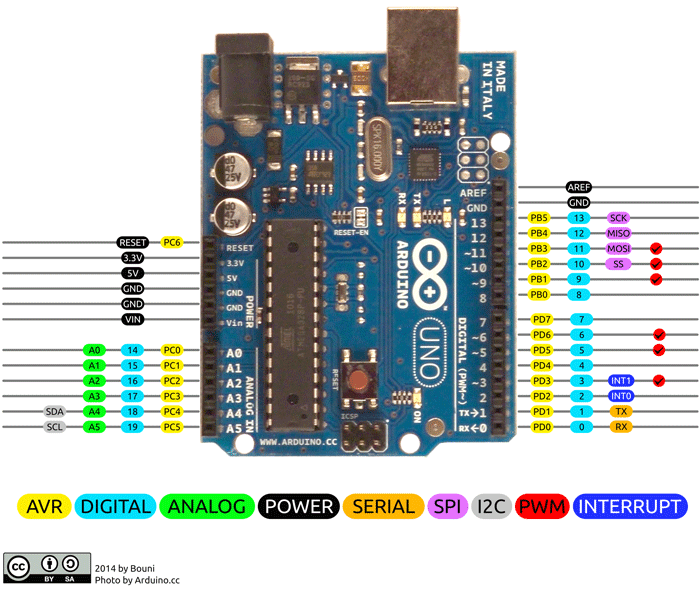
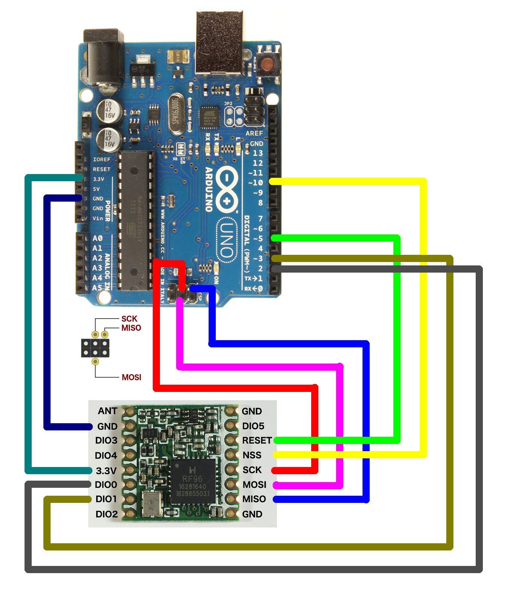
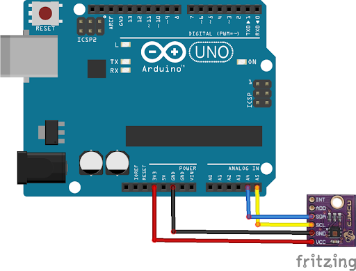

# sensor-tag(arduino-hdc2080-rfm98-esp32)
A sensor tag M2M network using atmega328p as a microcontroller and LORA RFM98 as a transmitter module to sense humidity and temperature. 
## Main Features
* This module will sense the data and send it to the gateway at aa predefined interval.
* Works on 3.7 li-Ion battery.
* Power efficient sensor node with battery indication.
* When antenna is connected to the module then the node can transmit upto a range of 1 kilometer.


## Hardware
*  3.3V 16MHz (with ATmega328P)
* 3.3V RFM98 module
* TI HDC2080 temperature and humidity sensor
* ESP32

## Materials
* Arduino code with sleep mode and the rfm connections.
* Similar ESP32 code with sleep mode and transmission btu it consumes more power as compared to Arduino328p.
* Reciever code.
* HDC2080 Datasheet.(http://www.ti.com/lit/ds/symlink/hdc2080.pdf)
* Rfm98 datasheet.(https://cdn.sparkfun.com/assets/learn_tutorials/8/0/4/RFM95_96_97_98W.pdf)
* Arduino 328p Datasheet.(http://ww1.microchip.com/downloads/en/DeviceDoc/Atmel-7810-Automotive-Microcontrollers-ATmega328P_Datasheet.pdf)
* ESP32 Datasheet.(https://www.espressif.com/sites/default/files/documentation/esp32_datasheet_en.pdf)
* Li-Ion battery->18650mAh battery.(https://www.banggood.in/buy/18650-battery.html)

## Software
### Installation Instructions
- Using Arduino IDE Boards Manager (preferred)
  + [Instructions for Boards Manager](docs/arduino-ide/boards_manager.md)
- Using Arduino IDE with the development repository
  + [Instructions for Windows](docs/arduino-ide/windows.md)
  + [Instructions for Mac](docs/arduino-ide/mac.md)
  + [Instructions for Debian/Ubuntu Linux](docs/arduino-ide/debian_ubuntu.md)
  + [Instructions for Fedora](docs/arduino-ide/fedora.md)
  + [Instructions for openSUSE](docs/arduino-ide/opensuse.md)
- [Using PlatformIO](docs/platformio.md)
- [Building with make](docs/make.md)
- [Using as ESP-IDF component](docs/esp-idf_component.md)
- [Using OTAWebUpdater](docs/OTAWebUpdate/OTAWebUpdate.md)

### Decoding exceptions

You can use [EspExceptionDecoder](https://github.com/me-no-dev/EspExceptionDecoder) to get meaningful call trace.

### Issue/Bug report template
Before reporting an issue, make sure you've searched for similar one that was already created. Also make sure to go through all the issues labelled as [for reference](https://github.com/espressif/arduino-esp32/issues?utf8=%E2%9C%93&q=is%3Aissue%20label%3A%22for%20reference%22%20).

Finally, if you are sure no one else had the issue, follow the [ISSUE_TEMPLATE](docs/ISSUE_TEMPLATE.md) while reporting any issue.

### ESP32Dev Board PINMAP


### Arduino uno PINMAP


### LORA RFM98 PINMAP


### Arduino with HDC2080 PINMAP




#### Additional Installation on Arduino IDE 1.8+

1. Add the following URL to the Arduino Boards Manager (*File->Preferences*).
   ```
   https://github.com/watterott/ATmega328PB-Testing/raw/master/package_m328pb_index.json
   ```

2. Update the **Arduino AVR Boards** to version **1.6.22** or higher via the Boards Manager (*Tools->Boards->Boards Manager*).

3. Install the **ATmega328PB Boards** via the Boards Manager (*Tools->Boards->Boards Manager*).


